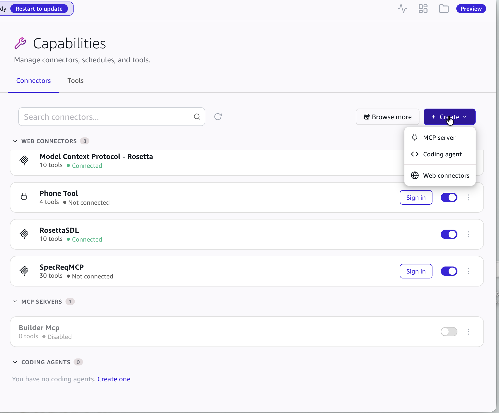
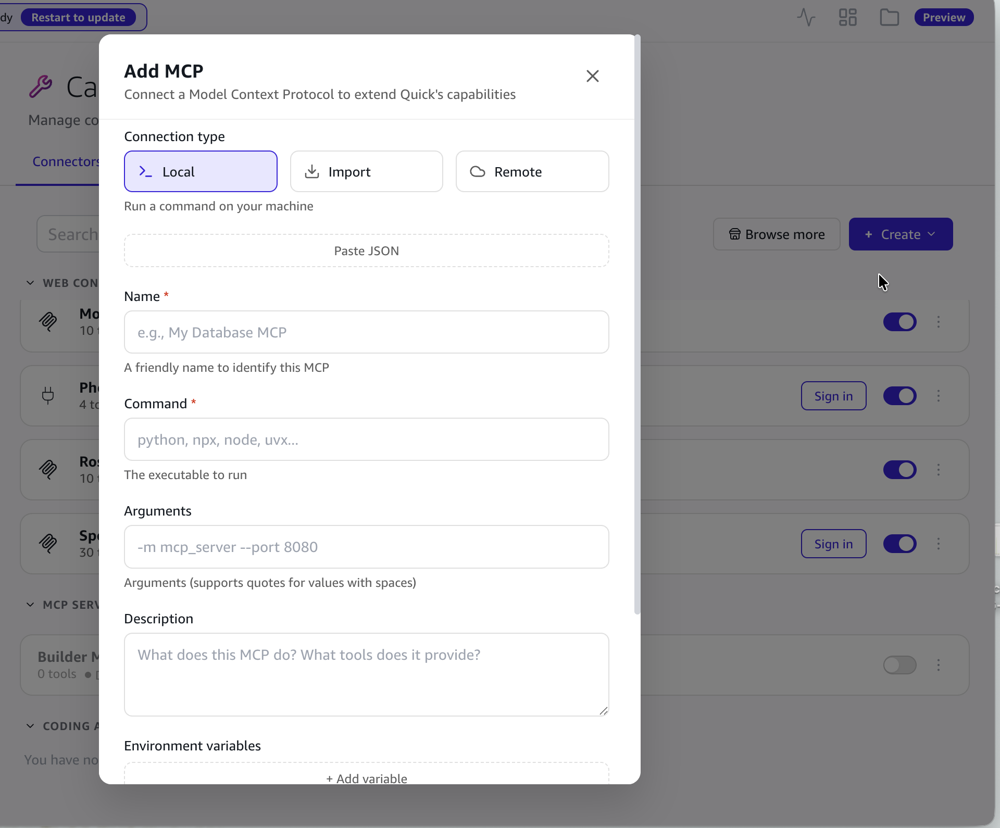
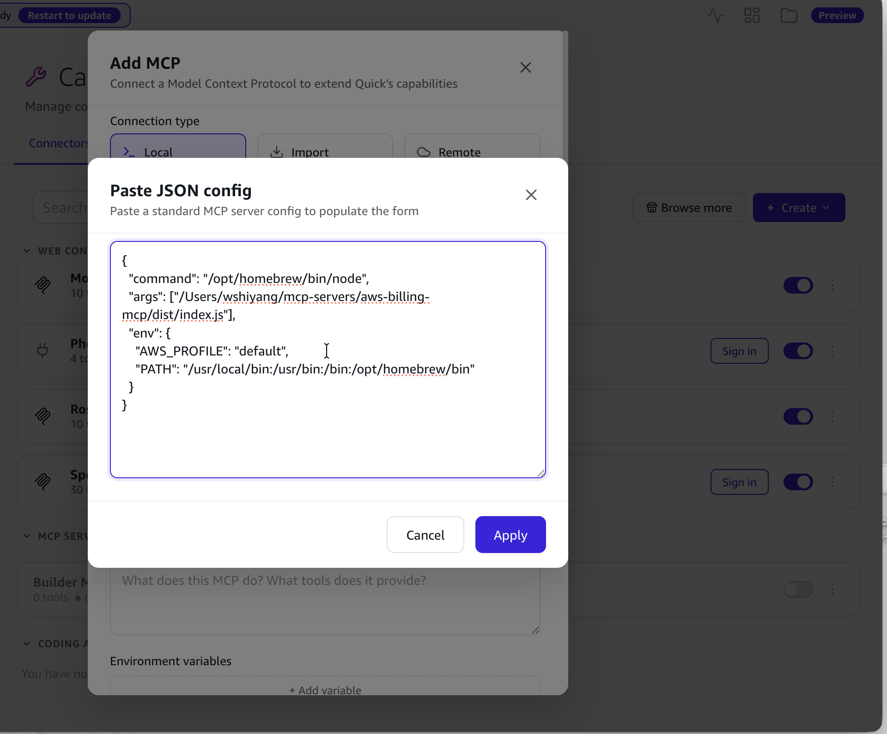
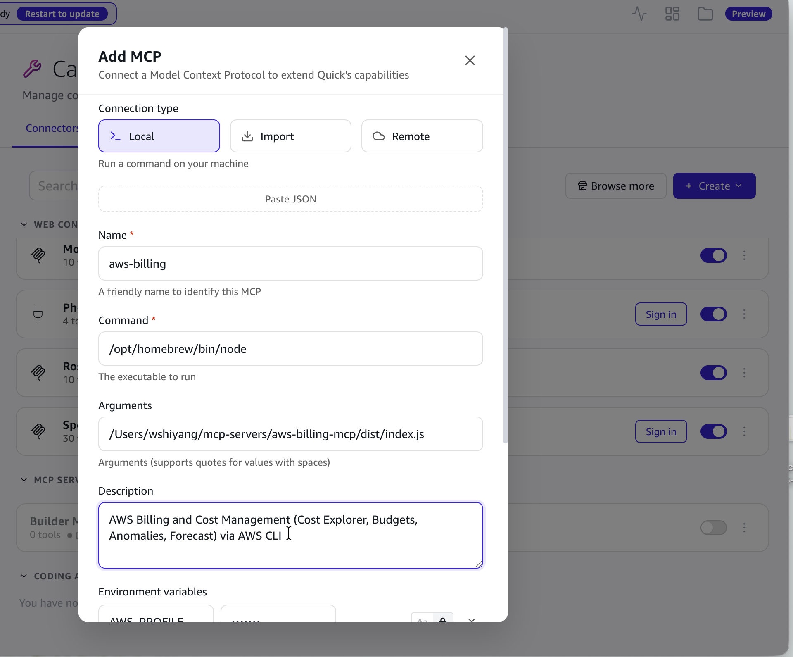
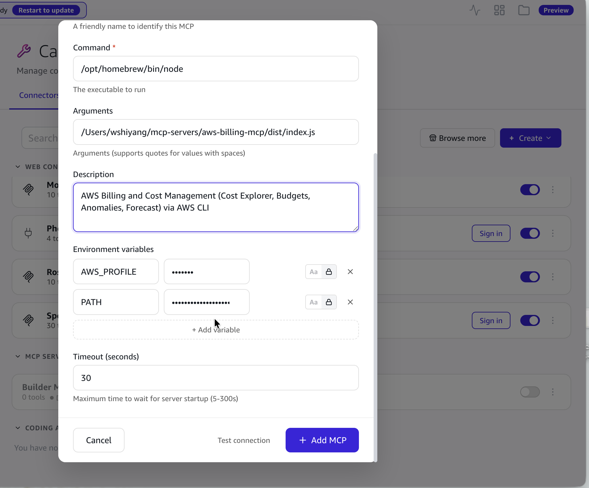
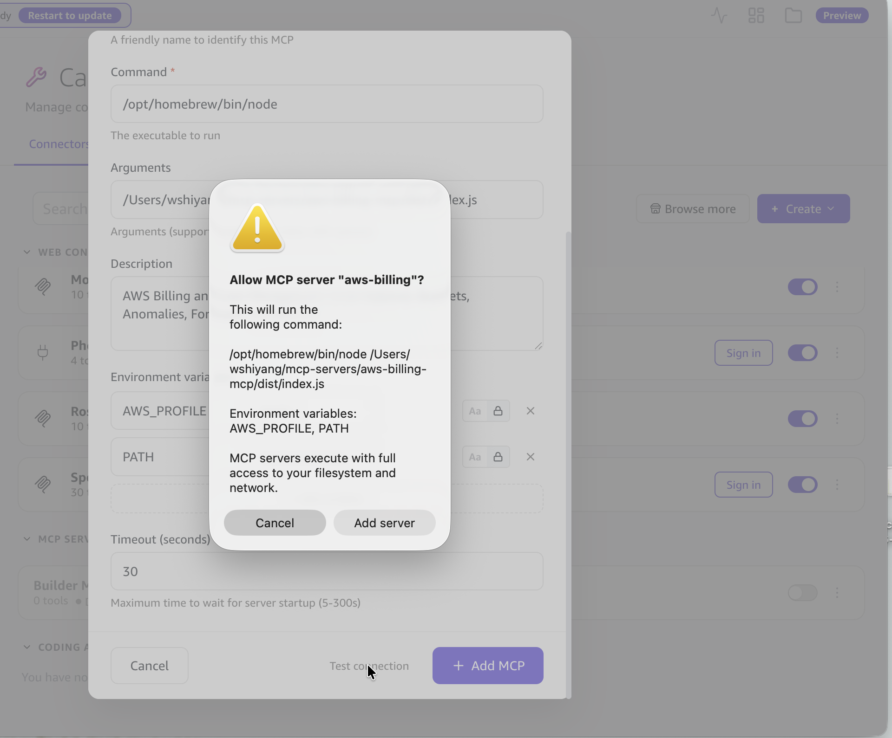
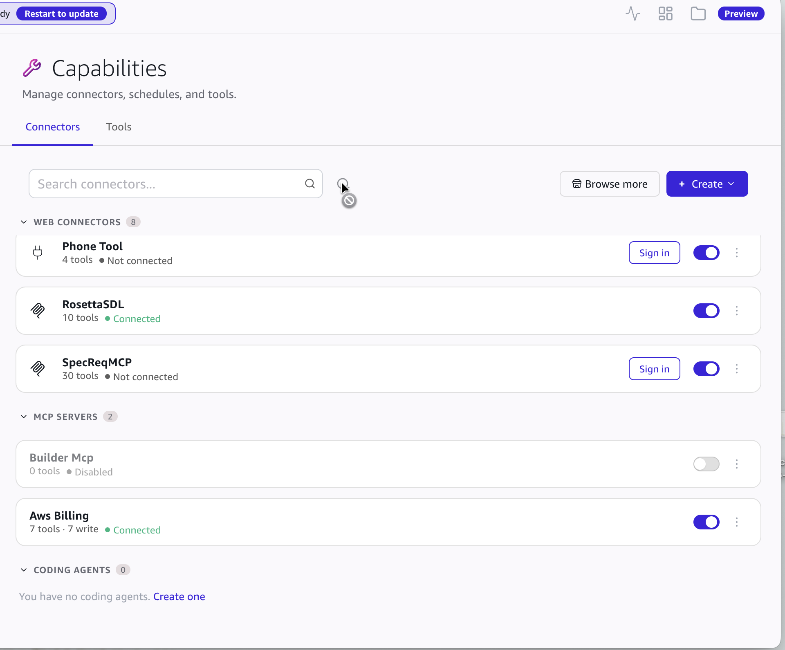

# Runbook: Connecting the aws-billing MCP Server to Amazon Quick Desktop

- Audience: macOS users who want Amazon Quick Desktop (Quick Work) to directly query/analyze the Billing and Cost Management data of their own AWS account
- MCP server source: <https://github.com/aws-samples/sample-cap-quant/tree/main/aws-billing-mcp>
- Verified environment: macOS, Amazon Quick Desktop v0.1000.x, Node.js 24, AWS CLI v2 (verified 2026-09-04)
- Reading conventions:
  - `<HOME>` is the absolute path of your home directory, obtained with `echo $HOME` (e.g. `/Users/alice`)
  - `<NODE>` is the absolute path of the node executable, obtained with `which node` (typically `/opt/homebrew/bin/node` for Homebrew, or `<HOME>/.nvm/versions/node/vXX/bin/node` for nvm; the nvm path changes when node is upgraded, so you'd need to update the Command in Quick afterward, or switch to Homebrew's fixed path)
  - `<PROFILE>` is the data directory name of Quick's currently logged-in profile; see section 4.5 for how to find it
  - The `/Users/wshiyang/...` paths appearing in screenshots are example paths on the author's machine — replace them with your own

---

## 1. Prerequisite checks

| Item | Requirement | How to check |
|---|---|---|
| Node.js | ≥ 18 | `node --version`; note the output of `which node` — you'll need the absolute path later |
| AWS CLI | v2 | `aws --version`; note the directory containing `aws` from `which aws` (typically `/usr/local/bin` or `/opt/homebrew/bin`) |
| AWS credentials | A working profile (this guide uses `default`) | The profile exists in `~/.aws/credentials` or `~/.aws/config`, with a region configured |
| IAM permissions | `ce:Get*`, `budgets:ViewBudget`, `sts:GetCallerIdentity` | See commands below; Cost Explorer must have been enabled once in the Billing console |
| Quick Desktop | Installed and logged in | `/Applications/Amazon Quick.app` or `/Applications/Amazon Quick 2.app` — both share the same config directory |

Check commands (change the dates to last month):

```bash
node --version && which node
aws --version && which aws
aws sts get-caller-identity
aws ce get-cost-and-usage --time-period Start=2026-08-01,End=2026-09-01 \
  --granularity MONTHLY --metrics UnblendedCost
```

If the last command returns numbers, your Cost Explorer permissions are OK.

> If Quick is launched from the GUI, it does **not inherit AK/SK exported in your shell**. Credentials must live in `~/.aws/credentials`, or be configured in `~/.aws/config` via SSO/assume-role etc.

## 2. Install and build

```bash
# Clone the repo (only the aws-billing-mcp subdirectory is needed)
cd /tmp && git clone --depth 1 https://github.com/aws-samples/sample-cap-quant.git
mkdir -p ~/mcp-servers
cp -R /tmp/sample-cap-quant/aws-billing-mcp ~/mcp-servers/aws-billing-mcp

# Build
cd ~/mcp-servers/aws-billing-mcp
npm install
npm run build          # tsc compiles to dist/index.js
```

You can choose any install directory; the rest of this guide uses `<HOME>/mcp-servers/aws-billing-mcp`.

## 3. Command-line smoke test (run this before connecting to Quick)

```bash
cd ~/mcp-servers/aws-billing-mcp
npm test
```

Expected output:

- `aws-billing-mcp ready (expected account: any, aws cli: aws)`
- `TOOLS:` listing 7 tools: `get_cost_and_usage, get_dimension_values, get_cost_forecast, get_cost_anomalies, describe_budgets, get_cost_allocation_tags, get_commitment_utilization`
- `TOP5 SERVICES:` this month's top 5 by service
- `FORECAST:` forecast through the end of the month

If this step fails, don't connect to Quick yet — it's usually a credentials or IAM permission problem.

## 4. Connecting to Amazon Quick Desktop (desktop app GUI)

> Prerequisites: `dist/index.js` from section 2 is built, and the smoke test in section 3 passes.

### 4.1 Open the MCP add dialog

1. Open the **Amazon Quick** desktop app.
2. In the left navigation, go to **Settings → Capabilities**, then the **Connectors** tab.
3. Click the **+ Create** dropdown in the top right and choose **MCP server**.

   

4. The **Add MCP** form appears. Keep Connection type at the default **Local** ("Run a command on your machine").

   

### 4.2 Fill the form in one step with Paste JSON

1. Click the **Paste JSON** button at the top of the form.
2. First, generate a JSON snippet with absolute paths filled in and copy it to the clipboard from a terminal:

```bash
AWS_BIN_DIR=$(dirname "$(which aws)")
cat <<EOF | pbcopy
{
  "command": "$(which node)",
  "args": ["$HOME/mcp-servers/aws-billing-mcp/dist/index.js"],
  "env": {
    "AWS_PROFILE": "default",
    "PATH": "$AWS_BIN_DIR:/usr/bin:/bin:/opt/homebrew/bin"
  }
}
EOF
pbpaste   # take a look — confirm all paths are absolute and there is no ~
```

   The generated result looks like:

```json
{
  "command": "<NODE>",
  "args": ["<HOME>/mcp-servers/aws-billing-mcp/dist/index.js"],
  "env": {
    "AWS_PROFILE": "default",
    "PATH": "/usr/local/bin:/usr/bin:/bin:/opt/homebrew/bin"
  }
}
```

   Notes:
   - This is a **single server object** — do not include an outer `mcpServers` wrapper, or Quick won't parse it and the Apply button stays grayed out.
   - `command` must be the absolute path to node. GUI apps don't inherit your shell's PATH, so plain `node` won't be found.
   - `env.PATH` must include the directory containing `aws` — the server fetches data by invoking the AWS CLI.
   - If your credentials profile isn't named `default`, change `AWS_PROFILE` accordingly.
   - Optional: add `"EXPECTED_ACCOUNT": "<12-digit account ID>"` — the server will verify credential ownership on first use, preventing accidental queries against the wrong account.

3. Paste it into the dialog and click **Apply**. The Command, Arguments, and Environment variables sections are filled in automatically.

   

### 4.3 Complete the remaining fields

| Field | What to enter |
|---|---|
| Name (required) | `aws-billing` (shown as "Aws Billing" in Quick's list) |
| Command (required) | `<NODE>` (populated by the JSON) |
| Arguments | `<HOME>/mcp-servers/aws-billing-mcp/dist/index.js` (populated) |
| Description | e.g. `AWS Billing and Cost Management (Cost Explorer, Budgets, Anomalies, Forecast) via AWS CLI` |
| Environment variables | `AWS_PROFILE`, `PATH` (populated; values shown masked) |
| Timeout (seconds) | Default 30 is sufficient |

The top half of the completed form:



Scrolling down: environment variables, Timeout, and the bottom buttons:



### 4.4 Test and save

1. Click **Test connection** at the bottom. A native macOS confirmation dialog appears — **"Allow MCP server "aws-billing"?"** — listing the command to be executed and the environment variable names. Verify them and click **Add server** to allow.

   

   On success there is no persistent indicator in the UI. To confirm, check the logs (see 4.6) — you'll see `Received mcp_test_connection` completing within a few hundred milliseconds.
2. Click **+ Add MCP**. The same confirmation dialog appears **a second time** — click **Add server** again.
3. After the form closes, **Aws Billing** appears in the MCP SERVERS list. It may initially show `0 tools · Disabled`; click the **refresh icon** next to the search box (or wait a few seconds) and it changes to **`7 tools · 7 write · Connected`** with the toggle on.

   

At this point you can ask questions directly in Quick, e.g.: "How much did this account spend in total last month? Rank the top 10 by service."

### 4.5 What the GUI flow does behind the scenes

Quick stores its MCP configuration **per login profile**:

```
~/.quickwork/profiles/<PROFILE>/mcp_config.json
```

To find `<PROFILE>`:

```bash
python3 -c "import json;p=json.load(open('$HOME/.quickwork/profiles.json'));print([e['data_path'] for e in p['entries']], 'active:', p['last_active'])"
```

`data_path` is the directory name, and `last_active` is the currently active profile. Enterprise Federate logins are typically `profiles/federate-prod`. The top-level `~/.quickwork/mcp_config.json` is a legacy file that Quick no longer reads — editing it has no effect.

After adding via the GUI, Quick automatically writes the entry into the file above, and the **env values are not persisted on disk** — they are replaced with secret references:

```json
"aws-billing": {
  "description": "AWS Billing and Cost Management (...) via AWS CLI",
  "command": "<NODE>",
  "args": ["<HOME>/mcp-servers/aws-billing-mcp/dist/index.js"],
  "env": {
    "AWS_PROFILE": "secret://aws-billing::e::aws_profile",
    "PATH": "secret://aws-billing::e::path"
  }
}
```

Other points:

- **No Quick restart is needed.** When servers are added/removed via the GUI, the agent hot-reloads; the log shows `[UserMCP] Config changed, reloading servers...`.
- Within about a second of saving, the log shows `aws-billing-mcp ready` → `Started ... with 7 tools` → `Loaded 1/1 servers (0 failed), 7 total tools`.
- Removal also goes through the GUI: **⋮ → Remove** on the Aws Billing row. The log shows `[UserMCP] Removed server 'aws-billing'`, and the corresponding secrets and permission preferences are cleaned up.

### 4.6 Command-line verification

```bash
# The server process has been started by Quick (one each for backend and worker — seeing 1–2 is normal)
pgrep -fl "aws-billing-mcp/dist/index.js"

# Confirm via logs (rotated hourly in UTC)
grep -E "UserMCP|aws-billing-mcp ready" \
  ~/Library/Logs/quickwork/quickwork-$(date -u +%Y-%m-%d-%H).log | grep -v discover_connectors | tail
```

## 5. Troubleshooting

| Symptom | What to check |
|---|---|
| Apply grayed out after Paste JSON / form not filled | The pasted JSON has an outer `mcpServers` wrapper. Only a single server object (`command` / `args` / `env`) is accepted |
| List shows `0 tools · Disabled` after saving | The list hasn't refreshed. Click the refresh icon or wait a few seconds; if the log already shows `Loaded 1/1 servers`, it's actually running |
| Nothing happens when clicking Test connection / Add MCP | The native macOS "Allow MCP server" dialog may be hidden behind other windows — you must click Add server |
| Log shows `Loaded 0/1 servers (1 failed)` | The server failed to start; check the stderr near `[UserMCP]` at the same timestamp. Usually the node path isn't absolute, or `env.PATH` doesn't include the directory containing `aws` |
| Server reports `aws: command not found` | `env.PATH` doesn't include `dirname $(which aws)` |
| `Unable to locate credentials` | The GUI doesn't read AK/SK exported in your shell — credentials must be in `~/.aws/credentials`; or check that the `AWS_PROFILE` name is correct |
| `AccessDeniedException ... ce:GetCostAndUsage` | IAM is missing `ce:Get*`; Cost Explorer must have been enabled once in the Billing console |
| `EXPECTED_ACCOUNT` mismatch error | The current credentials are not for the target account — confirm with `aws sts get-caller-identity` |
| Behavior unchanged after editing server source | Changes to `src/` require re-running `npm run build` — Quick uses `dist/index.js`; then Remove and re-Add in the GUI, or restart Quick |
