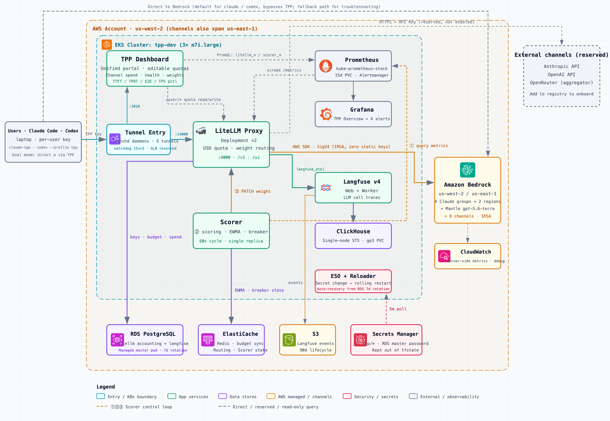

# TPP — Token Proxy Platform

- A proxy platform providing unified access to multiple LLM token channels (the Anthropic official API / the OpenAI official API / aggregators / cloud providers such as AWS Bedrock)
- Provides per-user daily USD quotas, channel × model metrics, call traces, and intelligent channel traffic scheduling based on quality scoring
- Deployment target: AWS EKS, managed with Terraform + Helm.

## Architecture Components

| Capability | Implementation |
|---|---|
| Channel access / routing / USD budget | LiteLLM Proxy |
| Metrics (TTFT / TPOT / E2E / Error) | kube-prometheus-stack (self-hosted, inside EKS) |
| Trace | Langfuse (self-hosted, with ClickHouse) |
| Intelligent weight scheduling | In-house Scorer (queries Prometheus every minute to compute scores → adjusts weights via the LiteLLM Management API) |
| Dashboard | **TPP Dashboard** (in-house unified portal: editable user quotas; channel spend / health / weights; TTFT / TPOT / E2E / TPS percentiles) + links to LiteLLM UI / Langfuse UI / Grafana / Prometheus |
| Metadata storage | RDS PostgreSQL + ElastiCache Redis |

## Architecture Diagram



Vector version: [`docs/architecture-diagram.svg`](docs/architecture-diagram.svg). The editable source with an export toolbar is
[`docs/architecture-diagram.html`](docs/architecture-diagram.html), generated by `docs/architecture-diagram.gen.py`.

## Repository Layout

```
docs/                 Architecture design documents
local/                Milestone 0: docker-compose local validation environment
infra/                Terraform: AWS infrastructure (envs/ + modules/)
apps/                 Terraform helm_release: in-cluster application layer (separate state)
charts/               Helm charts for in-house components (scorer, etc.)
services/scorer/      Intelligent weight scheduling service source code
services/dashboard/   TPP Dashboard (unified portal) source code: FastAPI aggregation backend + static single-page frontend
```
## Terraform Layout

```
infra/                          # state 1: infrastructure (changes infrequently)
├── envs/{dev,prod}/            # composition layer: main.tf / backend.tf / terraform.tfvars
└── modules/
    ├── network/                # VPC, public/private subnets, NAT, VPC Endpoints (S3/ECR/Bedrock)
    ├── eks/                    # cluster, managed node groups, IRSA OIDC, core addons
    ├── rds/                    # PostgreSQL: litellm + langfuse databases (single instance in dev, splittable in prod)
    ├── elasticache/            # Redis
    ├── s3/                     # Langfuse events bucket
    └── iam/                    # IRSA roles: LiteLLM (bedrock:InvokeModel*/Converse* + bedrock-mantle:CreateInference),
                                #   Langfuse (S3), ESO (SecretsManager read)
apps/                           # state 2: in-cluster applications (changes frequently, helm_release)
    platform.tf                 # alb-controller, external-secrets, reloader, kube-prometheus-stack
    litellm.tf  langfuse.tf  scorer.tf
    tpp-dashboard.tf            # TPP Dashboard (unified portal): ECR repo, Deployment, shared channel registry ConfigMap
    dashboards.tf               # Grafana TPP Overview dashboard + PrometheusRule alerts
```

Why two states: a plan/apply for a channel-config change never touches the infrastructure, keeping the blast radius small;
the whole setup can later be migrated to ArgoCD as-is. All secrets flow through Secrets Manager → ESO and never land in tfstate.

## Deployment

Two paths: **local docker-compose** (quickly validate configuration and wiring) and **full AWS EKS deployment** (production form).

### Option 1: Local validation (docker-compose)

```bash
cd local
cp .env.example .env          # fill in an API key for at least one channel
docker compose up -d          # LiteLLM + Postgres + Redis + Prometheus + Grafana
docker compose --profile trace up -d   # optional: add Langfuse (with ClickHouse/MinIO)
```

Smoke test (local LiteLLM listens on 4000):

```bash
curl http://localhost:4000/v1/chat/completions \
  -H "Authorization: Bearer $LITELLM_MASTER_KEY" -H "Content-Type: application/json" \
  -d '{"model": "claude-opus-5", "messages": [{"role": "user", "content": "hello"}]}'
```

### Option 2: Full AWS EKS deployment

The deployment order is fixed: **bootstrap (one-time) → infra (state 1) → apps (state 2) → Scorer / Dashboard images → access and verification**.

#### 0. Prerequisites

| Item | Requirement |
|------|------|
| Tools | Terraform ≥ 1.10, AWS CLI v2, kubectl, Docker (with buildx) |
| AWS credentials | Administrator (or equivalent) permissions; `aws sts get-caller-identity` returns successfully |
| Region | us-west-2 recommended (good Bedrock Claude model availability); the default channel registry also uses us-east-1 |
| Bedrock | Anthropic Claude model access enabled in both regions (Model access); us-west-2 additionally needs the Mantle OpenAI model enabled (`openai.gpt-5.6-terra`) |
| VPC CIDR | Defaults to 10.80.0.0/16; change `infra/envs/dev/variables.tf` if it conflicts with existing address space |

#### 1. Bootstrap: tfstate storage (one-time)

Both states share a single S3 bucket; Terraform ≥ 1.10 uses S3 native locking (`use_lockfile`), so no DynamoDB is needed:

```bash
aws s3api create-bucket --bucket tpp-tfstate-<aws account> --region us-west-2 \
  --create-bucket-configuration LocationConstraint=us-west-2
aws s3api put-bucket-versioning --bucket tpp-tfstate-<aws account> \
  --versioning-configuration Status=Enabled
```

Then replace `<aws account>` in the backend bucket name `tpp-tfstate-<aws account>` in
`infra/envs/dev/versions.tf`, `apps/versions.tf`, and `apps/providers.tf` with your own account ID;
if you prefer not to edit the files, you can also override it at init time:

```bash
terraform init -backend-config="bucket=tpp-tfstate-<aws account>"
```

#### 2. State 1 — Infrastructure (infra/)

```bash
cd infra/envs/dev
terraform init
terraform plan
terraform apply        # about 20 minutes; the EKS control plane and RDS are slow to create
```

This produces: the VPC (public/private subnets + NAT + S3/ECR/Bedrock VPC Endpoints), the EKS cluster `tpp-dev` (managed node group + IRSA OIDC), RDS PostgreSQL (litellm / langfuse databases), ElastiCache Redis, the Langfuse events S3 bucket, and three IRSA roles (LiteLLM→Bedrock, Langfuse→S3, ESO→SecretsManager). All outputs are read by state 2 via `terraform_remote_state`.

Configure kubeconfig:

```bash
aws eks update-kubeconfig --name tpp-dev --region us-west-2
```

#### 3. State 2 — In-cluster applications (apps/)

**The first deployment (or an environment rebuild) requires two apply passes**: CRD resources such as ClusterSecretStore depend on the external-secrets chart being installed into the cluster first, and a single all-at-once plan fails outright because the CRDs do not exist:

```bash
cd apps
terraform init

# Pass 1: platform components (StorageClass, ALB controller, external-secrets, kube-prometheus-stack)
terraform apply -target=kubernetes_storage_class_v1.gp3 \
  -target=helm_release.alb_controller -target=helm_release.external_secrets \
  -target=helm_release.kube_prometheus_stack

# Pass 2: everything (LiteLLM, Langfuse, Scorer, Grafana dashboards, and the CRD resources)
terraform apply
```

The secrets pipeline is fully automated; no Secret needs to be created by hand: the apply generates the LiteLLM master key (Secrets Manager `tpp/litellm`) and the Langfuse bootstrap credentials (`tpp/langfuse`), which ESO syncs into in-cluster Secrets; the RDS password directly references the RDS-managed secret. For the automatic recovery mechanism around RDS password rotation, see [Runbook: RDS credential rotation and automatic recovery](docs/runbook.md#rds-credential-rotation-and-automatic-recovery).

#### 4. Scorer and Dashboard images (first time only)

The apps apply has already created the ECR repos `tpp/scorer` and `tpp/dashboard`, but the images for both in-house components must be built and pushed manually
(until then the scorer / dashboard pods sit in ImagePullBackOff, which is expected):

```bash
aws ecr get-login-password --region us-west-2 | \
  docker login --username AWS --password-stdin <aws account>.dkr.ecr.us-west-2.amazonaws.com

# Scorer
cd services/scorer
docker buildx build --platform linux/amd64 \
  -t <aws account>.dkr.ecr.us-west-2.amazonaws.com/tpp/scorer:0.1.0 --push .
kubectl rollout restart deploy/scorer -n scorer

# TPP Dashboard
cd ../dashboard
docker buildx build --platform linux/amd64 \
  -t <aws account>.dkr.ecr.us-west-2.amazonaws.com/tpp/dashboard:0.1.2 --push .
kubectl rollout restart deploy/dashboard -n dashboard
```

The image tags correspond to `scorer_image_tag` in `apps/scorer.tf` (default `0.1.0`) and
`dashboard_image_tag` in `apps/tpp-dashboard.tf` (default `0.1.2`); to upgrade an image, change the tag and run `terraform apply`.

#### 5. Channel registration

The channel registry lives in `apps/values/scorer-channels.yaml` (by default 5 model groups totaling 9 Bedrock channels: 4 Claude groups × the usw2/use1 regions, plus a single usw2 channel for `gpt-5.6-terra` (an OpenAI model on Bedrock Mantle)). On startup, the Scorer writes them idempotently into the DB via the LiteLLM Management API `/model/new` — deliberately bypassing LiteLLM's static config, because statically configured models cannot have their weights adjusted dynamically through the Management API. Bedrock channels authenticate via IRSA and need no API keys at all.

To add or change channels: edit that file → `cd apps && terraform apply` (the ConfigMap change triggers a rolling restart of the Scorer, which re-registers automatically on startup; new channels ramp up from a cold-start score of 0.5 plus the guaranteed floor traffic).

#### 6. Access and verification

The dev environment exposes no public Ingress; access goes through port-forward tunnels (see the Runbook for a persistent launchd-managed setup):

```bash
./scripts/tpp-tunnels.sh   # LiteLLM :14000 / Grafana :3000 / Langfuse :3010 / Prometheus :9090 / TPP Dashboard :3020
```

For day-to-day work, start from the **TPP Dashboard (http://localhost:3020)**: the home page aggregates user quotas, channel spend / health / weights,
and channel performance percentiles, and provides links to the other four dashboards.

Smoke test:

```bash
export MASTER_KEY=$(cd apps && terraform output -raw litellm_master_key)
curl http://localhost:14000/v1/chat/completions \
  -H "Authorization: Bearer $MASTER_KEY" -H "Content-Type: application/json" \
  -d '{"model": "claude-sonnet-5", "messages": [{"role": "user", "content": "hello"}]}'
```

Verification checklist:

- `kubectl get pods -A` — all pods in the litellm / langfuse / scorer / dashboard / monitoring namespaces are Running;
- the TPP Dashboard (:3020) channel table lists all 9 channels, and the "requests" count of the channel that served the smoke request above becomes non-zero;
- the TPP Overview dashboard in Grafana (:3000) shows request metrics;
- Langfuse (:3010) shows the trace of the smoke request above;
- once there is traffic, `kubectl logs -n scorer deploy/scorer` shows `weights updated`.

For day-to-day operations after deployment (creating users and per-user quotas, tuning scoring parameters, cost-saving switches), the RDS credential rotation recovery pipeline, and the Scorer scoring algorithm, see the [Runbook](docs/runbook.md);

for the key architecture decisions and their trade-offs, see the [ADR](docs/ADR.md).
